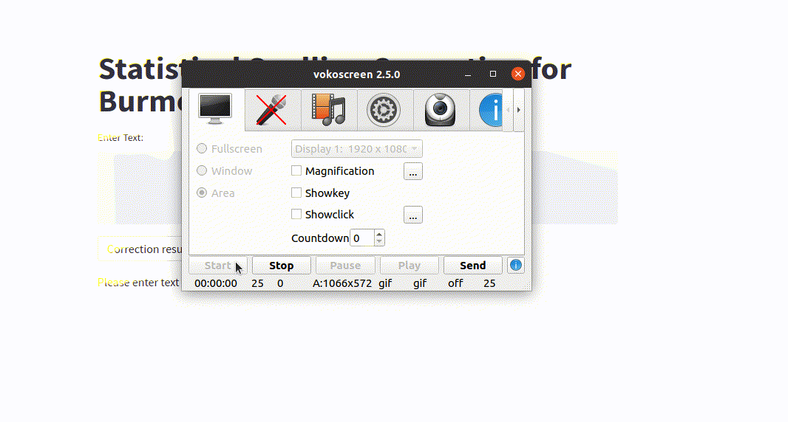

# Spelling Correction for Burmese Language using Statistical Methods

**Author : Thura Aung**

Spelling Correction mini-project ​လေး တစ်ခု စမ်း​ရေးကြည့်ထားပါတယ်။ Ruled-based မသွားဘဲ Statistical နည်း ၂ ခု ဖြစ်တဲ့ n-gram similarity[1] နဲ့ SymSpell[2] ကို အသုံးပြုထားပါတယ်။

SymSpell ကို မြန်မာစာ အတွက် သုံးတာ ပထမဆုံး​တော့ မဟုတ်ပါ။ သိပ်မကြာ​သေးခင် 2021 Dec ​လောက်က SymSpell4Burmese[3] ဆိုပြီး စနစ်တကျ သု​တေသန ပြုထားတဲ့ Conference စာတမ်း တစ်​စောင် ရှိပြီးသားပါ။ 

ခုက အက္ခရာအမှား ​တွေ ( ဥပမာ ကြက်ဉ ကို ကြက်ဥ ) ကို မှန်မှန် ပြင်​ပေးနိုင်တယ်။ သို့​သော် အိပ်မက် ကို​တော့ အိမ်မက်လို့ မသိဘူး။

ဒါက ကျွန်​တော် အသုံးပြုထားတဲ့ Dictionary ​ကြောင့် ဖြစ်ပါလိမ့်မယ်။ Dictionaries တွေက ​myPOS[4][5]  ver3.0 က​နေ ယူထားပြီး myWord[6] tool နဲ့ ထုတ်ထားတာပါ။ myPOS ver3.0 ဆိုတာ ဆရာ ​ဒေါက်တာရဲ​ကျော်သူတို့ ​နေရာ​ပေါင်းစုံက​နေ အချိန်အ​တော်​ပေးပြီး စုထားတာ ဖြစ်တဲ့အတွက် သတ်ပုံ အမှန်​ရော အမှားပါ ​ရော​ထွေး​နေနိုင်ပါတယ်။

အက္ခရာ နဲ့ အသံထွက် အမှား​တွေ ( ဥပမာ ဂျင်းထည့်, ဘာဖစ်လဲ ) အတွက်က သတ်ပုံ Corpus နဲ့ ​သေချာ ထုတ်ထားတဲ့ dictionaries ​တွေရှိလာရင် အဆင်​ပြေပါမယ်။ [3] မှာလည်း ဆရာ​ ဒေါက်တာ ရဲ​ကျော်သူတို့ ကြိုးစားထားတာ​တွေ ရှိတာ​ကြောင့် ပို​ကောင်းတဲ့ dictionaries ​တွေ ရလာနိုင်ပါတယ်။

ဗန်းစကား​ အသုံးတွေ 
ဥပမာ သယ်ရင်း -> သူငယ်ချင်း

စာရိုက်မှားတာ​တွေ 
ဥပမာ မှ ူးမတ်​​ငေနာပတိ -> မှူးမတ်​သေနာပတိ

ဒါမျိုး​တွေ အတွက်က​တော့ တခြား deep learning approaches ​တွေ လိုဦးမယ် ထင်ပါတယ်။[7]

mySpellCorrect ကို သုံးမယ်ဆိုရင်​တော့ Word အတွက် အသုံးပြုမယ်ဆို ပိုအဆင်​ပြေပါတယ်။ Sentence ​တွေကို Input အ​နေနဲ့ ထည့်မယ်ဆိုရင် Word level ဖြတ်ထား​ပေးဖို့ လိုပါတယ်။ 

symspellpy library[2] မှာလည်း dictionaries ​ပေါ် အ​ခြေခံပြီး Word level ဖြတ်​ပေးတာ ပါပါတယ်။ mySpellCorrect.py မှာ Comment လုပ်ထားခဲ့ပါတယ်။ )

## Usage

အသုံးမပြုခင် လိုအပ်တဲ့ library ​တွေ modules ​တွေ ​install ထားဖို့ လိုပါတယ်။

```{r, engine='bash', count_lines}
pip install -r requirements.txt
```

တစ်ဖိုင်လုံး Correction လုပ်ချင်တဲ့ ဖိုင် ရှိရင် ဒီလို အသုံးပြုပါ။

```{r, engine='bash', count_lines}
python ./mySpellCorrect.py -i test.txt
```

help ကို သုံးပြီး parameter ​တွေ ကြိုက်သလို သုံးပါ။

```{r, engine='bash', count_lines}
python mySpellCorrect.py -h
usage: mySpellCorrect.py [-h] [-cp CORPUS] [-ut UNIGRAM_DICT] [-bt BIGRAM_DICT] [-i INPUT] [-o OUTPUT] [-m MODE]

Statistical Spelling Correction for Burmese language

optional arguments:
  -h, --help            show this help message and exit
  -cp CORPUS, --corpus CORPUS
                        corpus file for n-gram
  -ut UNIGRAM_DICT, --unigram_dict UNIGRAM_DICT
                        unigram frequency dictionary file
  -bt BIGRAM_DICT, --bigram_dict BIGRAM_DICT
                        bigram frequency dictionary file
  -i INPUT, --input INPUT
                        input file
  -o OUTPUT, --output OUTPUT
                        output file
  -m MODE, --mode MODE  s for symspell and n for n-gram spelling correction
```

တခြား Program ​တွေထဲ ထည့်သုံးချင်ရင် ဒီလို ​ခေါ် သုံးလို့ ရပါတယ်။
```{r, engine='bash', count_lines}
from mySpellCheck import ngramSpell
sentence = "မ ဟုတ် ဘူးး"
ngramSpell(sentence)

>> ['မ ဟုတ် ဘူး']
```
```{r, engine='bash', count_lines}
from mySpellCheck import mySymSpell
sentence = "မ ဟုတ် ဘူးး"
mySymSpell(sentence)

>> ['မ ဟုတ် ဘူး']
```

GUI နဲ့ စမ်းချင်ရင်​ 

```{r, engine='bash', count_lines}
streamlit run gui.py
```

GUI ကို Streamlit သုံးပြီးပဲ ​ရေးထားပါတယ်။

အ​ရေးကြီးတာက Citation ပါ။
​ဒေတာ​တွေက ကျွန်​တော့် အပိုင် မဟုတ်ပါ။ ဒါ​ကြောင့် ​ဒီ Repository ထဲက ​ဒေတာ တစ်စုံတရာကို အသုံးပြု​တော့မယ် စိတ်ကူးရင် ​အောက်ပါ Citation ​လေး​တွေ​တော့ Reference ထဲမှာ သက်ဆိုင်ရာ အလိုက် ထည့်​ပေးဖို့ ​မေတ္တာ ရပ်ခံလိုပါတယ်။

## Demo


## Citation
### Notice that all of the data I have used are not my property and please check the Licenses

If you want to use any data or dictionary under ./data folder in your research and we'd appreciate if you use the following three references:

- Khin War War Htike, Ye Kyaw Thu, Zuping Zhang, Win Pa Pa, Yoshinori Sagisaka and Naoto Iwahashi, "Comparison of Six POS Tagging Methods on 10K Sentences Myanmar Language (Burmese) POS Tagged Corpus", at 18th International Conference on Computational Linguistics and Intelligent Text Processing (CICLing 2017), April 17~23, 2017, Budapest, Hungary.*
- Zar Zar Hlaing, Ye Kyaw Thu, Myat Myo Nwe Wai, Thepchai Supnithi, Ponrudee Netisopakul, "Myanmar POS resource extension effects on automatic tagging methods", In Proceedings of the 15th International Joint Symposium on Artificial Intelligence and Natural Language Processing (iSAI-NLP 2020), Nov 18 to Nov 20, 2020, Bangkok, Thailand, pp. 189-194.*
- myWord: Syllable, Word and Phrase Segmenter for Burmese, Ye Kyaw Thu, Sept 2021, GitHub Link: https://github.com/ye-kyaw-thu/myWord**

## References:

- [1] Vacláv Chvátal and David Sankoff. "Longest common subsequences of two random sequences", 1975. Journal of Applied Probability, Python module: ngram (https://pypi.org/project/ngram/).

- [2] Wolf Garbe <wolf.garbe@faroo.com> Description: https://medium.com/@wolfgarbe/1000x-faster-spelling-correction-algorithm-2012-8701fcd87a5f .URL: https://github.com/wolfgarbe/symspell .Python module: symspellpy (https://github.com/mammothb/symspellpy)

- [3] Mon, Ei & Kyaw Thu, Ye & Yu, Than & Oo, Aye. (2021). SymSpell4Burmese: Symmetric Delete Spelling Correction Algorithm (SymSpell) for Burmese Spelling Checking. 1-6. 10.1109/iSAI-NLP54397.2021.9678171. 

- [4] Khin War War Htike, Ye Kyaw Thu, Zuping Zhang, Win Pa Pa, Yoshinori Sagisaka and Naoto Iwahashi, "Comparison of Six POS Tagging Methods on 10K Sentences Myanmar Language (Burmese) POS Tagged Corpus", at 18th International Conference on Computational Linguistics and Intelligent Text Processing (CICLing 2017), April 17~23, 2017, Budapest, Hungary.*

- [5] Zar Zar Hlaing, Ye Kyaw Thu, Myat Myo Nwe Wai, Thepchai Supnithi, Ponrudee Netisopakul, "Myanmar POS resource extension effects on automatic tagging methods", In Proceedings of the 15th International Joint Symposium on Artificial Intelligence and Natural Language Processing (iSAI-NLP 2020), Nov 18 to Nov 20, 2020, Bangkok, Thailand, pp. 189-194.*

- [6] myWord: Syllable, Word and Phrase Segmenter for Burmese, Ye Kyaw Thu, Sept 2021, GitHub Link: https://github.com/ye-kyaw-thu/myWord**

- [7] https://bhashkarkunal.medium.com/spelling-correction-using-deep-learning-how-bi-directional-lstm-with-attention-flow-works-in-366fabcc7a2f

\* I used myPOS ver3 (without POS-tags) for building dictionaries

\** built dictionaries using myWord tool
